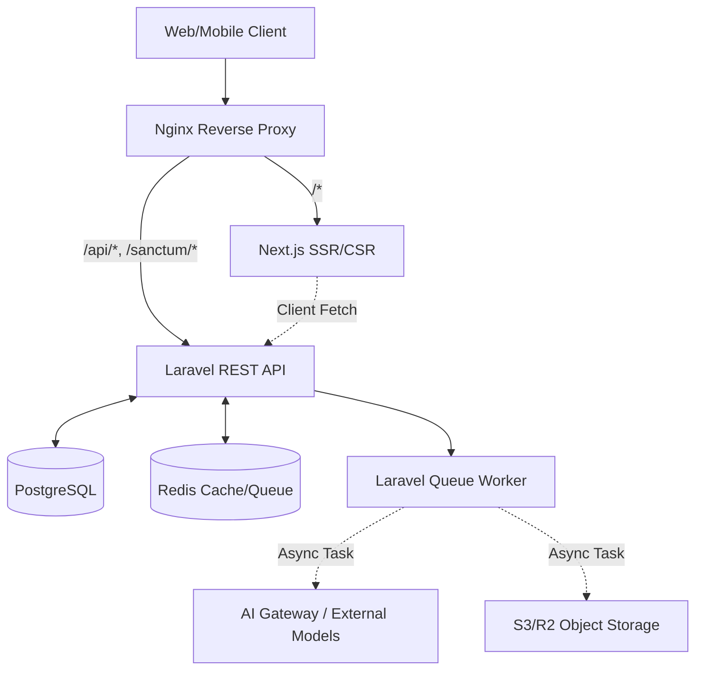
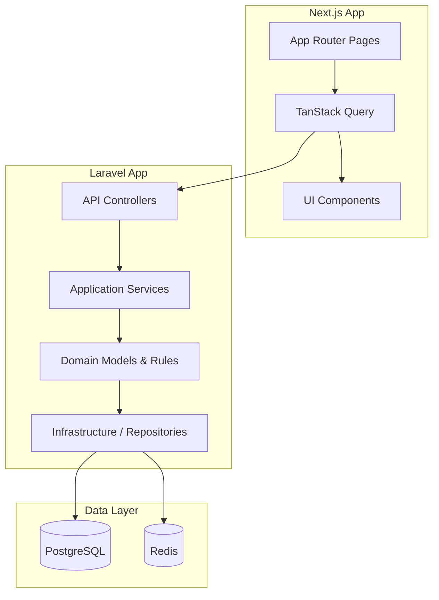
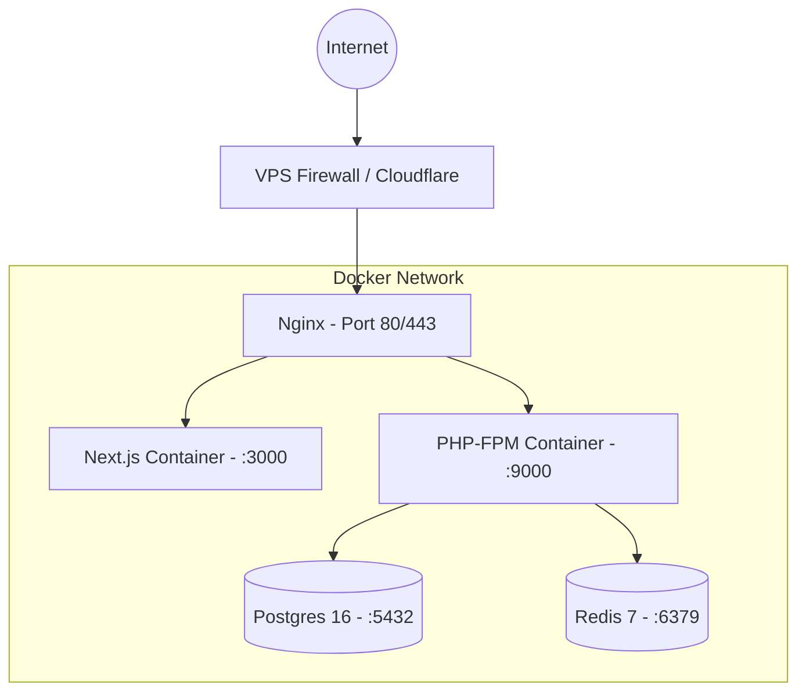

# System Architecture & Technology Decision

## 1. High Level Architecture

Sistem AI Smart Barbershop dirancang menggunakan pendekatan **Decoupled Architecture** dengan pemisahan yang jelas antara lapisan antarmuka pengguna (Frontend), logika bisnis (Backend), dan layanan pemrosesan intensif (AI Services).



## 2. Component Diagram



## 3. Deployment Diagram



---

## 4. Technology Decision

Pemilihan teknologi difokuskan pada *developer experience*, performa produksi, biaya infrastruktur awal yang rendah, dan kemampuan *scale-up* di masa depan.

### 4.1 Frontend: Next.js 15 & Tailwind CSS
**Alasan:**
- Mendukung SSR (Server-Side Rendering) untuk SEO pada Landing Page dan Blog.
- CSR (Client-Side Rendering) untuk Dashboard yang highly interactive.
- Ekosistem React yang matang (shadcn/ui, TanStack Query, React Hook Form).
**Trade-off:**
- Ukuran node_modules yang besar dan build time yang lebih lama dibanding Vanilla JS/Vite murni. Kompleksitas server/client components.

### 4.2 Backend: Laravel 12
**Alasan:**
- Ekosistem komplit (ORM matang, Queue System bawaan, Event/Listener, Authentication via Sanctum).
- Struktur MVC yang jelas dan mudah diadaptasi ke Clean Architecture/Domain Driven Design.
- Pengembangan API yang sangat cepat dengan performa memadai untuk MVP hingga skala menengah.
**Trade-off:**
- Bukan arsitektur asinkron murni secara default (meski ada Laravel Octane). Konkurensi tinggi memerlukan scaling horizontal (tambah worker/server).

### 4.3 Database: PostgreSQL 16
**Alasan:**
- Dukungan JSONB yang sangat baik untuk menyimpan properti AI dinamis (AI features, rule mapping).
- Kepatuhan ACID yang kuat, cocok untuk sistem booking dan transaksi.
- Relational mapping yang presisi untuk struktur hirarkis (Branch -> Barber -> Booking).
**Trade-off:**
- Sedikit lebih berat dalam hal penggunaan memory pada idle state dibandingkan MySQL/SQLite.

### 4.4 Cache & Message Broker: Redis 7
**Alasan:**
- Kecepatan in-memory yang krusial untuk fitur Real-time Queue Tracking (estimasi antrian).
- Berfungsi ganda sebagai Cache (menyimpan referensi AI Rules sementara) dan Message Broker (memproses AI Request secara background).
**Trade-off:**
- Data bersifat volatile. Perlu konfigurasi AOF/RDB jika ingin persistensi penuh.

### 4.5 AI Integration: API-Based (External Models)
**Alasan:**
- Menjalankan model AI Computer Vision dan Image Generation di VPS lokal akan membutuhkan GPU mahal ($$$/bulan).
- Menggunakan API pihak ketiga (OpenAI/Gemini/Replicate/RunPod) menggeser beban komputasi AI dari CapEx ke OpEx (Pay as you go).
**Trade-off:**
- Latency tambahan karena request ke eksternal. Risiko downtime dari pihak ketiga. Mitigasi dengan Queue Worker.

### 4.6 Deployment: Docker Compose
**Alasan:**
- Konsistensi lingkungan dari local ke production (VPS).
- Isolasi service. Mudah di-_teardown_ dan di-_rebuild_.
**Trade-off:**
- Kurang cocok untuk auto-scaling elastis. (Jika mencapai skala enterprise, akan bermigrasi ke Kubernetes (K8s) atau AWS ECS).

---

## 5. Folder Structure Architecture

```text
AIbarber/
├── backend/                     # Laravel 12 (API Backend)
│   ├── app/
│   │   ├── Domain/              # Business Rules (Customer, Booking, AI, etc.)
│   │   ├── Application/         # Use Cases & Services
│   │   ├── Infrastructure/      # Repositories & External API Adapters
│   │   └── Http/                # Controllers & Middleware
├── frontend/                    # Next.js 15 (Client)
│   ├── src/
│   │   ├── app/                 # Routes (App Router)
│   │   ├── components/          # Reusable UI & Layouts
│   │   ├── features/            # Feature-based logic (Booking, AI, Auth)
│   │   └── lib/                 # Utilities & API Clients
├── docs/                        # Architecture & PRD
│   ├── architecture/
│   ├── api/
│   ├── database/
│   ├── deployment/
│   └── ai/
├── docker-compose.yml           # Infrastructure as Code
└── deploy.md                    # DevOps runbook
```
