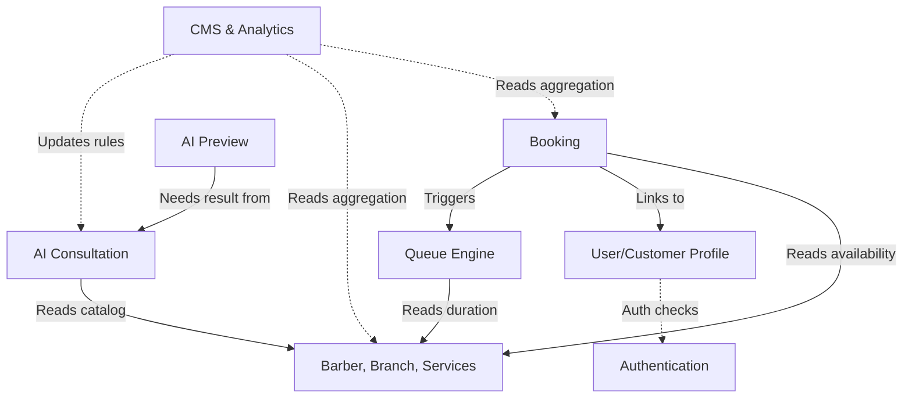

# Module Breakdown & Service Boundary

Arsitektur AI Smart Barbershop membagi sistem ke dalam modul-modul independen (Modular Monolith) dengan batasan tanggung jawab (*boundary*) yang jelas. Tidak ada modul yang boleh mem-bypass logika modul lain.

## 1. Module Definition

### 1.1 Authentication & Authorization Module
- **Tanggung Jawab:** Menangani proses login, register, password reset, pembuatan token (JWT/Sanctum), dan pengecekan Role-Based Access Control (RBAC).
- **Domain:** User, Role, Permission, Token.
- **Dependency:** Dipanggil oleh setiap request yang membutuhkan autorisasi.

### 1.2 User / Customer Profile Module
- **Tanggung Jawab:** Manajemen data profil pengguna, alamat, nomor telepon, dan preferensi profil (catatan potong rambut khusus).
- **Domain:** CustomerProfile, UserPreference.
- **Dependency:** Bergantung pada Authentication. Digunakan oleh Booking dan Barber Module.

### 1.3 Barber & Branch Module
- **Tanggung Jawab:** Manajemen data cabang barbershop, data barber, spesialisasi, jadwal kerja, portfolio, dan status ketersediaan.
- **Domain:** Branch, Barber, Schedule, Portfolio.
- **Dependency:** Independen. Digunakan sebagai referensi oleh Booking Module.

### 1.4 Service / Catalog Module
- **Tanggung Jawab:** Manajemen katalog layanan potong rambut, durasi estimasi (krusial untuk antrian), dan harga. Termasuk database model gaya rambut.
- **Domain:** HairService, Hairstyle, Category.
- **Dependency:** Independen. Digunakan oleh Booking dan AI Module.

### 1.5 Booking Module
- **Tanggung Jawab:** Orkestrasi pemesanan jadwal. Memvalidasi slot waktu, menghitung ketersediaan barber, dan menghasilkan nomor booking.
- **Domain:** Booking, TimeSlot.
- **Dependency:** Bergantung pada Barber, Service, dan Customer Profile. Memanggil Queue Module setelah booking berhasil.

### 1.6 Queue Management Module
- **Tanggung Jawab:** Engine utama untuk antrian *real-time*. Menghitung estimasi waktu mulai (*Estimated Start Time*), mengelola status antrian (Waiting, Called, Serving), dan menangani *Late Policy*.
- **Domain:** Queue, EstimatedTime.
- **Dependency:** Sangat bergantung pada data durasi dari Service Module dan status dari Booking Module.

### 1.7 AI Consultation Module
- **Tanggung Jawab:** Menangani *Face Analysis*, *Recommendation Scoring*, dan percakapan AI Chat. Modul ini membungkus kompleksitas API eksternal.
- **Domain:** FaceAnalysis, AIRecommendation, ChatHistory.
- **Dependency:** Membaca data Hairstyle dari Service Module. Tidak bergantung pada Booking.

### 1.8 AI Preview Module (Image Generation)
- **Tanggung Jawab:** Menangani logika manipulasi gambar dan verifikasi pelestarian identitas wajah (*Identity Verification*).
- **Domain:** HairMask, PreviewImage.
- **Dependency:** Bergantung pada AI Consultation (hanya bisa mem-preview gaya yang direkomendasikan).

### 1.9 CMS & Analytics Module
- **Tanggung Jawab:** Antarmuka pengelola data master (Master Data Management), aturan AI (AI Rules & Prompts), promosi, dan pelaporan pendapatan/performa.
- **Domain:** RevenueReport, SystemSettings, Content (Blog, Promo).
- **Dependency:** Membaca agregasi data dari semua modul lain. (Bersifat *Read-Heavy*).

---

## 2. Service Boundary Map

Setiap modul hanya berinteraksi melalui *Application Services* (Interfaces/Contracts), bukan melalui *direct database access*.

## 3. Boundary Rules (Anti-Corruption Layer)

1. **Booking tidak boleh mengupdate Antrian (Queue) secara langsung via DB.**
   - *Rule:* Booking mengirimkan `BookingConfirmedEvent`. Queue Service mendengarkan event tersebut dan menghitung/memasukkan antrian baru.
2. **AI Preview tidak boleh dieksekusi tanpa Recommendation ID.**
   - *Rule:* Sistem akan menolak request generate gambar jika gaya rambut tersebut tidak ada di daftar top rekomendasi dari AI Consultation. (Mencegah penyalahgunaan API cost).
3. **Frontend tidak boleh tahu kalkulasi estimasi waktu (Queue Math).**
   - *Rule:* Frontend murni menerima output timestamp `estimated_start_time` dari Backend API. Semua matematika keterlambatan (Late Policy) dan kalkulasi durasi terjadi tertutup di backend.
