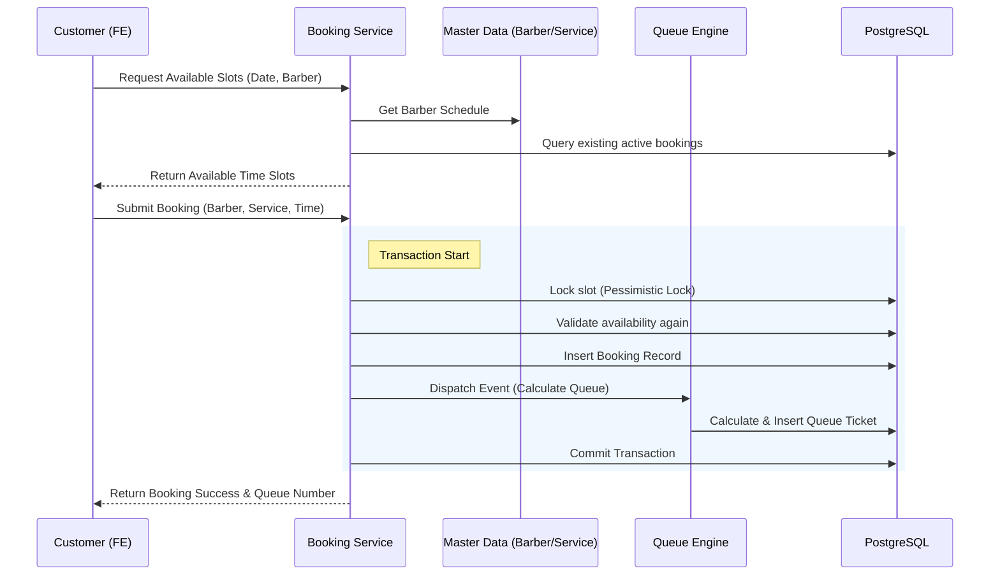
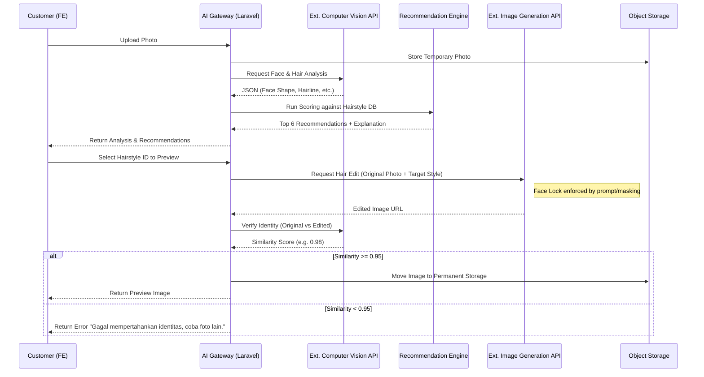
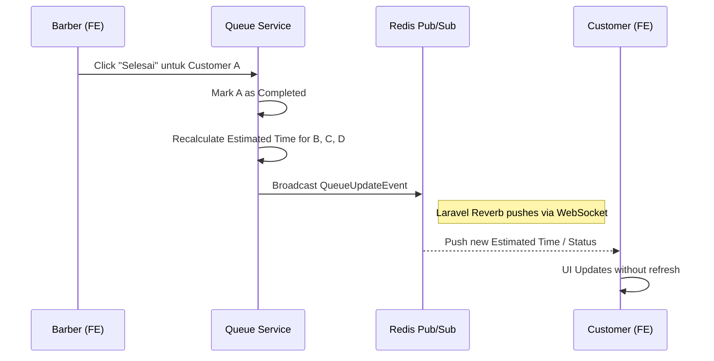

# Data Flow & Integration

## 1. Booking Data Flow

Proses booking merupakan aliran data yang tersinkronisasi untuk memastikan tidak ada *double booking* dan antrian terekam dengan akurat.

## 2. AI Recommendation & Preview Flow

Mengacu pada prinsip **Recommendation Before Generation** dan **Identity Preservation**.

## 3. Real-time Queue Update Flow

## 4. External Integrations

Sistem berinteraksi dengan dunia luar melalui port/adapter yang terenkapsulasi:

| Integration Point | Purpose | Interface/Driver (Backend) |
|---|---|---|
| **Computer Vision AI** | Face detection & segmentation | `FaceAnalysisClient` (e.g., RunPod/Replicate) |
| **Generative AI** | Hair masking & replacement | `ImageGenerationClient` (e.g., Stable Diffusion Inpainting API) |
| **LLM (OpenAI/Gemini)** | AI Chat Consultant | `AIChatClient` (e.g., OpenAI API) |
| **Object Storage** | Store uploads, portfolio, previews | `S3FilesystemDriver` (AWS S3/Cloudflare R2) |
| **Email Service** | Booking confirmation, password reset | `SmtpMailDriver` / Resend / Mailgun |
| **WhatsApp (Future)** | Queue reminders via WA | `WhatsAppNotificationChannel` |
