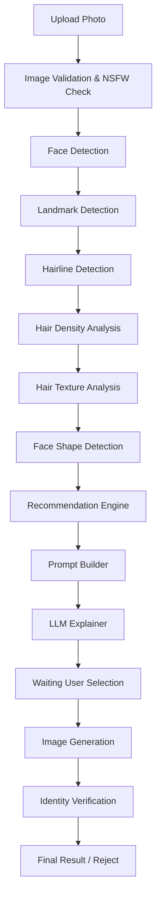
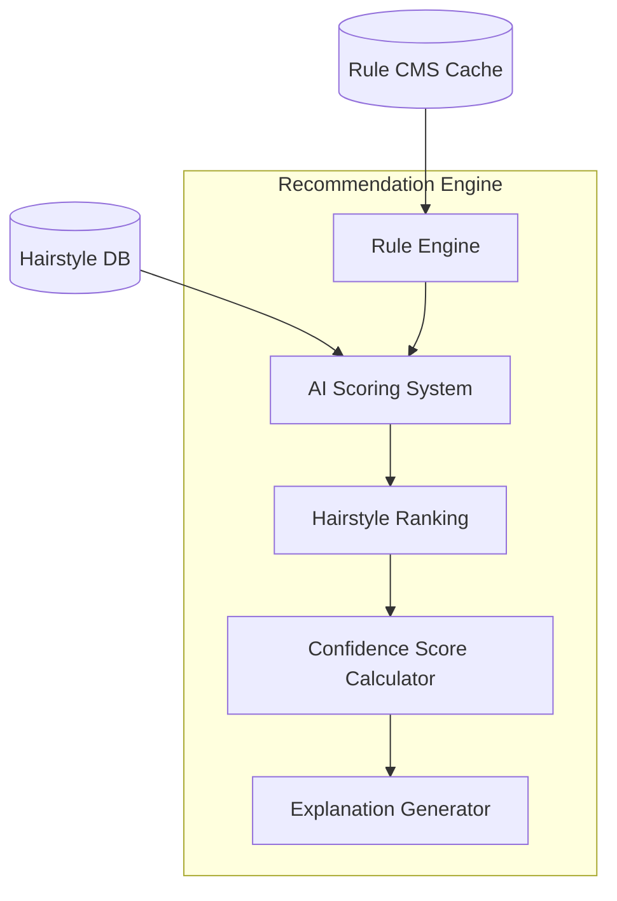
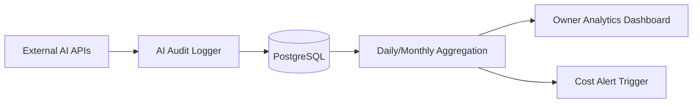

# Enterprise AI Architecture

Berdasarkan review arsitektur tahap akhir, modul AI diperluas menjadi standar enterprise. Dokumen ini mendefinisikan *AI Governance*, *Pipeline*, dan *Quality Assurance* untuk model AI.

## 1. Deep AI Pipeline

Proses AI dipecah menjadi pipeline mikrolitik.

## 2. Recommendation Engine Architecture

Recommendation Engine berdiri sebagai layanan tersendiri dengan arsitektur internal:

## 3. Dynamic AI CMS & Feature Flags

Pemilik barbershop memiliki kontrol penuh atas AI melalui CMS, tanpa perlu *redeployment*.

**Flow AI Rules CMS:**
`CMS UI` → `Hair Rule` → `Weight` → `Prompt Template` → `Negative Prompt` → `Published` → `Redis Cache`

**Feature Flags (Toggles):**
Sistem mengadopsi Feature Flags untuk mitigasi risiko.
- `AI_PREVIEW_ENABLED` (Boolean)
- `AI_CHAT_ENABLED` (Boolean)
- `BOOKING_ENABLED` (Boolean)

## 4. AI Versioning & Audit

Setiap operasi AI dapat diaudit dan direproduksi.
Tabel `ai_audit_logs` akan mencatat:
- `engine_version` (misal: v1.2.0)
- `prompt_version` (misal: p_202607)
- `rule_version` (misal: r_004)
- `photo_url` (Signed URL temporary)
- `generated_prompt` (Prompt final yang dikirim ke LLM)
- `model_used` (misal: gpt-4o, runpod-sdxl)
- `duration_ms` (Waktu latensi)
- `similarity_score` (Skor kemiripan wajah)
- `cost_usd` (Estimasi biaya)
- `output_result` (Raw JSON / URL result)

## 5. Multi-Layer Identity Preservation

*Identity Preservation* (Pelestarian Identitas) tidak hanya mengandalkan *Cosine Similarity*.

1. **Face Embedding Distance:** Mengukur jarak *feature vector* antara wajah asli dan hasil edit.
2. **Landmark Difference:** Mengukur pergeseran titik mata, hidung, dan bibir.
3. **Expression Difference:** Memastikan wajah tidak tiba-tiba tersenyum/sedih akibat generasi AI.
4. **Final Identity Score:** Bobot agregat dari ketiga metrik di atas.

Konfigurasi batas kelulusan (*Threshold*) diatur via CMS:
- `IDENTITY_THRESHOLD` (misal: `0.95`)
- Jika Final Score < Threshold, sistem akan otomatis melakukan *Retry* 1x, lalu jika tetap gagal akan mengeluarkan *Reject Response*.

## 6. AI Cost & Performance Monitoring

Setiap request ke external API dihitung biaya dan latensinya, kemudian di-dashboard-kan untuk owner.

- **Metrics Tracked:** Success Rate, Latency (p50, p90, p99), Cost per Provider (OpenAI/Gemini/RunPod), Rejection Rate.
