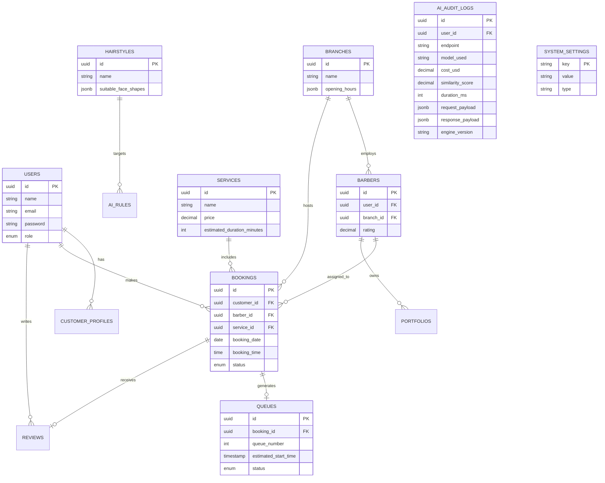

# Entity Relationship Diagram (ERD) & Database Architecture

Sistem menggunakan PostgreSQL 16. Skema ini mencakup dukungan untuk AI Versioning, Feature Flags, dan AI Auditing.

## 1. ERD (Mermaid)

## 2. Tabel Pendukung Enterprise AI & Governance

Selain tabel standar operasional barbershop, struktur ini menambahkan tabel khusus untuk mendukung konfigurasi dinamis.

### 2.1 Table: `ai_audit_logs`
Berfungsi sebagai pencatat seluruh aktivitas AI untuk *Debugging*, *Cost Monitoring*, dan *Quality Assurance*.

| Column | Type | Description |
|---|---|---|
| `id` | UUID | Primary Key |
| `user_id` | UUID | User yang melakukan request |
| `operation_type` | VARCHAR | Misal: `face_analysis`, `chat`, `preview` |
| `model_used` | VARCHAR | Misal: `gpt-4o`, `sdxl-inpainting` |
| `engine_version` | VARCHAR | Versi engine saat eksekusi |
| `duration_ms` | INTEGER | Latency eksekusi AI |
| `similarity_score`| DECIMAL(4,3)| Metrik pelestarian identitas (0.000 - 1.000) |
| `cost_usd` | DECIMAL(8,5)| Estimasi biaya API |
| `status` | VARCHAR | `success`, `retry`, `rejected` |
| `request_payload`| JSONB | Raw prompt / params |
| `response_payload`| JSONB | Raw result / errors |

### 2.2 Table: `ai_rules`
Aturan rekomendasi yang bisa diatur oleh Admin via CMS, tanpa mengubah kode sumber.

| Column | Type | Description |
|---|---|---|
| `id` | UUID | Primary Key |
| `face_shape` | VARCHAR | Kondisi pemicu (Oval, Round, etc) |
| `hairstyle_id` | UUID | Target rekomendasi |
| `score_boost` | INTEGER | Bobot penambahan (misal: +30) |
| `is_active` | BOOLEAN | Status rilis |

### 2.3 Table: `system_settings` (Feature Flags & Configs)
Konfigurasi dinamis (KV Store) yang di-cache di Redis.

| Key | Type | Example Value | Description |
|---|---|---|---|
| `feature_ai_preview` | boolean | `true` | Matikan/nyalakan AI image generation |
| `feature_booking` | boolean | `true` | Matikan/nyalakan booking online |
| `ai_identity_threshold`| float | `0.95` | Batas minimal kemiripan wajah |
| `ai_max_req_per_day` | integer | `5` | Batas request AI per user |
